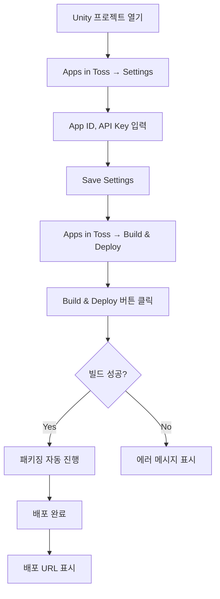
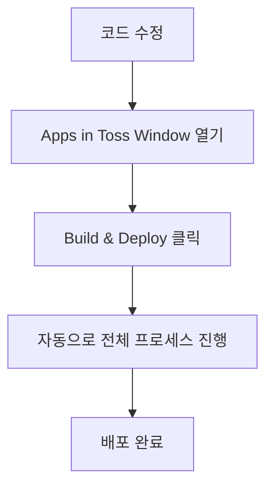
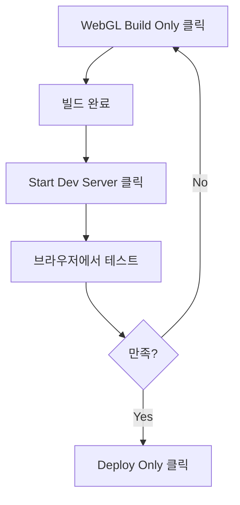

# Apps in Toss Unity Plugin - PRD (Product Requirements Document)

**버전**: 1.0.0
**작성일**: 2025-10-21
**최종 업데이트**: 2025-10-21
**상태**: 🟢 구현 완료 (테스트 대기중)

---

## 📋 개요

Unity 게임을 Apps in Toss 미니앱 플랫폼으로 쉽게 배포할 수 있도록 Unity Editor Plugin을 개발합니다. 기존에 수동으로 진행하던 WebGL 빌드, 패키징, 업로드 과정을 Unity Editor 내에서 원클릭으로 처리할 수 있게 자동화합니다.

---

## 🎯 목표

### 주요 목표
- Unity 개발자가 별도의 웹 개발 지식 없이 Apps in Toss에 게임을 배포할 수 있도록 함
- WebGL 빌드 → 패키징 → 배포 과정을 Unity Editor 내에서 완결
- 설정을 한 번만 하면 반복적으로 빌드/배포 가능

### 성공 지표
- 초기 설정 시간: 5분 이내
- 빌드-배포 프로세스: 클릭 3번 이내
- 사용자 만족도: 기존 수동 프로세스 대비 80% 이상 시간 절감

---

## 📌 현재 상태 (AS-IS)

### 배포 프로세스
1. **WebGL 빌드**
   - Unity Editor → File → Build Settings → WebGL → Build
   - 수동으로 빌드 폴더 지정
   - 빌드 시간: 5-15분

2. **패키징**
   - Vite 프로젝트 템플릿 수동 생성
   - WebGL 빌드 결과물을 수동으로 복사
   - `package.json`에 `@apps-in-toss/web-framework` 의존성 추가
   - `npm install` 실행
   - `npx ait init` 실행

3. **업로드**
   - Apps in Toss 콘솔에서 API 키 발급
   - `npm run deploy` 실행
   - API 키 입력

### 문제점
- ❌ 수동 작업이 많아 실수 발생 가능
- ❌ 웹 개발 지식 필요 (npm, Vite 등)
- ❌ 반복 작업이 번거로움
- ❌ Unity 개발자에게 친숙하지 않은 워크플로우

---

## 🎯 목표 상태 (TO-BE)

### 배포 프로세스
1. **초기 설정 (1회만)**
   - Unity Editor → Apps in Toss → Settings
   - App ID, API Key 입력
   - 저장

2. **빌드 & 배포 (반복)**
   - Unity Editor → Apps in Toss → Build & Deploy
   - 버튼 1개 클릭
   - 완료 대기

### 기대 효과
- ✅ Unity Editor 내에서 모든 작업 완결
- ✅ 웹 개발 지식 불필요
- ✅ 설정 재사용으로 반복 작업 최소화
- ✅ Unity 개발자 친화적 UI/UX

---

## 🚀 기능 요구사항

### 1. Unity Editor Window

**위치**: Unity Editor 상단 메뉴 `Apps in Toss`

#### 1.1 메뉴 구조
```
Apps in Toss
├── Build & Deploy Window    # 메인 윈도우 (단축키: Ctrl+Shift+A)
├── Settings                 # 설정 윈도우
├── Open Build Folder        # 빌드 폴더 열기
└── Documentation            # 온라인 문서 열기
```

#### 1.2 Build & Deploy Window

**섹션 1: 빌드 정보**
- 프로젝트 이름 (자동 감지)
- 현재 Unity 버전
- WebGL 빌드 상태 (마지막 빌드 시간)

**섹션 2: 빌드 옵션**
- [ ] Development Build (체크박스)
- [ ] Auto Connect Profiler (체크박스)
- Compression Format: [Gzip / Brotli / Disabled] (드롭다운)

**섹션 3: 액션 버튼** (큰 버튼들)
```
┌─────────────────────────────────┐
│   🔨 WebGL Build Only           │  ← WebGL 빌드만 실행
├─────────────────────────────────┤
│   📦 Package Only               │  ← 패키징만 실행 (빌드 결과물 있을 때)
├─────────────────────────────────┤
│   🌐 Start Dev Server           │  ← Vite 개발 서버 실행
├─────────────────────────────────┤
│   🚀 Build & Deploy             │  ← 전체 프로세스 (빌드→패키징→배포)
├─────────────────────────────────┤
│   📤 Deploy Only                │  ← 업로드만 실행
├─────────────────────────────────┤
│   ⚙️ Settings                   │  ← 설정 윈도우 열기
└─────────────────────────────────┘
```

**섹션 4: 진행 상태**
- Progress Bar
- 현재 작업 상태 텍스트
- 로그 출력 영역 (스크롤 가능)

### 2. 설정 관리 (Settings)

#### 2.1 기본 설정
```
App Information
├── App ID: _________________ (필수)
├── App Name: _______________ (선택)
└── App Version: ____________ (기본값: 1.0.0)

Build Settings
├── Build Output Path: ______ (기본값: {ProjectRoot}/Builds/WebGL)
├── Template Path: __________ (기본값: SDK 내장 템플릿)
└── Auto Open After Build: [✓] (체크박스)

Deployment
├── API Key: ________________ (필수, 암호화 저장)
├── Environment: [Production / Staging / Development]
└── Auto Deploy After Build: [ ] (체크박스)

Advanced
├── Node.js Path: ___________ (자동 감지, 수동 설정 가능)
├── NPM Registry: ___________ (기본값: registry.npmjs.org)
└── Custom Build Script: ____ (고급 사용자용)
```

#### 2.2 설정 저장 위치
- `ProjectSettings/AppsInTossSettings.asset` (Unity ScriptableObject)
- API Key는 암호화하여 저장
- Git에 커밋되지 않도록 `.gitignore` 자동 추가

#### 2.3 설정 초기화 버튼
- "Reset to Default" 버튼
- 확인 다이얼로그 표시

### 3. WebGL 빌드 자동화

#### 3.1 빌드 프로세스
1. **빌드 전 검증**
   - WebGL 플랫폼 설치 확인
   - 디스크 공간 확인 (최소 2GB)
   - 이전 빌드 백업 여부 확인

2. **빌드 실행**
   ```csharp
   BuildPipeline.BuildPlayer(scenes, outputPath, BuildTarget.WebGL, buildOptions);
   ```

3. **빌드 후 작업**
   - 빌드 성공/실패 로그 저장
   - 빌드 통계 (시간, 크기) 기록
   - 자동으로 다음 단계 진행 (옵션에 따라)

#### 3.2 빌드 최적화
- Incremental build 지원
- 멀티스레드 빌드 옵션
- 불필요한 에셋 제외 (설정 가능)

### 4. 템플릿 빌드 및 패키징

#### 4.1 템플릿 구조

SDK 내장 템플릿 위치: `apps-in-toss-unity-transform-sdk/ViteTemplate/`

```
ViteTemplate/
├── package.json              # @apps-in-toss/web-framework 포함
├── vite.config.js           # Vite 설정
├── index.html               # 엔트리 포인트
├── src/
│   ├── main.js             # 메인 스크립트
│   └── unity-loader.js     # Unity 로더 래퍼
└── public/                 # WebGL 빌드 결과물이 복사될 위치
    └── Build/
```

#### 4.2 package.json 템플릿

```json
{
  "name": "{{APP_NAME}}",
  "version": "{{APP_VERSION}}",
  "type": "module",
  "scripts": {
    "dev": "vite",
    "build": "vite build",
    "preview": "vite preview",
    "deploy": "ait deploy"
  },
  "dependencies": {
    "@apps-in-toss/web-framework": "latest"
  },
  "devDependencies": {
    "vite": "^5.0.0"
  }
}
```

#### 4.3 패키징 프로세스

1. **템플릿 복사**
   - SDK 내장 템플릿을 임시 작업 디렉토리로 복사
   - `{ProjectRoot}/.ait-build/` 사용

2. **WebGL 빌드 결과물 복사**
   - `Builds/WebGL/Build/` → `.ait-build/public/Build/`
   - `Builds/WebGL/StreamingAssets/` → `.ait-build/public/StreamingAssets/` (있는 경우)

3. **템플릿 변수 치환**
   - `{{APP_NAME}}` → 설정의 App Name
   - `{{APP_VERSION}}` → 설정의 App Version
   - `{{APP_ID}}` → 설정의 App ID

4. **의존성 설치**
   ```bash
   cd .ait-build
   npm install
   ```

5. **AIT 초기화**
   ```bash
   npx ait init
   ```
   - App ID 자동 입력
   - 필요한 설정 파일 생성

6. **빌드 실행**
   ```bash
   npm run build
   ```

### 5. 개발 서버 실행

#### 5.1 서버 실행 프로세스
```bash
cd .ait-build
npm run dev
```

#### 5.2 UI 동작
- 버튼 클릭 시 백그라운드에서 Vite 서버 실행
- Unity Editor 하단에 상태 표시
  - "Dev Server Running: http://localhost:5173"
  - "Stop Server" 버튼 표시
- 자동으로 기본 브라우저에서 열기 (옵션)

#### 5.3 서버 관리
- Unity Editor 종료 시 자동으로 서버 종료
- 수동 종료 버튼 제공
- 포트 충돌 감지 및 다른 포트 사용

### 6. 업로드 (배포)

#### 6.1 배포 프로세스
```bash
cd .ait-build
npm run deploy
```

#### 6.2 API Key 주입
- 환경변수로 API Key 전달
  ```bash
  AIT_API_KEY=xxx npm run deploy
  ```
- 또는 `.aitrc` 파일 자동 생성

#### 6.3 배포 후 처리
- 배포 성공 메시지 표시
- 배포된 URL 표시 및 클립보드 복사
- 배포 이력 저장

### 7. 설정 초기화

#### 7.1 초기화 대상
- 모든 설정 값 기본값으로 리셋
- API Key 삭제
- 빌드 캐시 삭제 (옵션)

#### 7.2 확인 절차
- 경고 다이얼로그 표시
- "정말 초기화하시겠습니까?" 확인
- 초기화 후 성공 메시지

---

## 🔧 기술 스펙

### Unity Editor 스크립트

#### 파일 구조
```
apps-in-toss-unity-transform-sdk/
└── Editor/
    ├── AppsInTossBuildWindow.cs         # 메인 윈도우
    ├── AppsInTossSettingsWindow.cs      # 설정 윈도우
    ├── AppsInTossSettings.cs            # ScriptableObject 설정
    ├── AppsInTossBuildPipeline.cs       # 빌드 파이프라인
    ├── AppsInTossTemplateProcessor.cs   # 템플릿 처리
    ├── AppsInTossDeployment.cs          # 배포 로직
    └── AppsInTossEditorUtility.cs       # 유틸리티 함수
```

#### 주요 클래스

**AppsInTossBuildWindow**
- Unity EditorWindow 상속
- 메인 UI 렌더링
- 버튼 이벤트 처리

**AppsInTossSettings**
- ScriptableObject 상속
- 설정 값 저장/로드
- Singleton 패턴

**AppsInTossBuildPipeline**
- BuildPipeline API 래핑
- 빌드 진행 상황 콜백
- 에러 핸들링

**AppsInTossTemplateProcessor**
- 템플릿 복사 및 변수 치환
- npm/npx 명령어 실행
- 프로세스 출력 캡처

**AppsInTossDeployment**
- npm run deploy 실행
- API Key 주입
- 배포 결과 파싱

### 템플릿 파일

#### ViteTemplate 개선
- 현재 있는 ViteTemplate 활용
- package.json에 `@apps-in-toss/web-framework` 추가
- Unity 로더 스크립트 최적화
- 변수 치환을 위한 플레이스홀더 추가

### Node.js 의존성

#### 필수 패키지
- `@apps-in-toss/web-framework`: latest
- `vite`: ^5.0.0

#### 환경 요구사항
- Node.js: 18.x 이상
- npm: 9.x 이상

---

## 🎨 UI/UX 가이드라인

### 디자인 원칙
1. **간결성**: 최소한의 클릭으로 작업 완료
2. **명확성**: 현재 상태와 다음 액션이 명확
3. **피드백**: 모든 작업에 대한 시각적 피드백
4. **에러 처리**: 친절한 에러 메시지와 해결 방법 제시

### 색상 가이드
- 🟢 성공: Green
- 🔵 진행중: Blue
- 🟡 경고: Yellow
- 🔴 에러: Red
- ⚪ 비활성: Gray

### 메시지 톤
- 긍정적이고 도움이 되는 톤
- 전문 용어 최소화
- 필요시 문서 링크 제공

---

## 📝 워크플로우

### 시나리오 1: 처음 사용하는 개발자



### 시나리오 2: 반복 배포



### 시나리오 3: 로컬 테스트



---

## ✅ 완료 기준

### Phase 1: 기본 기능 (MVP) ✅ 완료
- [x] Unity Editor Window 기본 UI
- [x] 설정 저장/로드 (기존 AITEditorScriptObject 활용)
- [x] WebGL 빌드 자동화
- [x] ViteTemplate 기반 빌드 (npm install, npx ait init)
- [x] 수동 배포 (버튼 클릭)

### Phase 2: 개발 편의성 ✅ 완료
- [x] 개발 서버 실행/종료
- [x] 빌드 진행 상황 표시 (로그 영역)
- [x] 에러 핸들링 및 로그
- [x] 설정 검증 (App ID 체크)

### Phase 3: 고급 기능 ⏳ 향후 개선
- [ ] 자동 배포 옵션
- [ ] 빌드 프로파일 (Dev/Staging/Prod)
- [ ] 빌드 캐시 관리
- [ ] 배포 이력 관리

---

## 🚧 제약사항 및 가정

### 제약사항
- Unity 2021.3 이상 필요 (WebGL 지원)
- Node.js 설치 필수
- macOS, Windows만 지원 (Linux는 Phase 2)

### 가정
- 사용자는 Apps in Toss 콘솔 계정이 있음
- 사용자는 기본적인 Unity 사용법을 알고 있음
- 인터넷 연결 필수 (npm install, deploy)

---

## 📅 일정

| Phase | 작업 내용 | 예상 기간 | 상태 |
|-------|----------|----------|------|
| Phase 1 | PRD 작성 및 설계 | 1일 | 🟡 진행중 |
| Phase 2 | SDK 구조 파악 | 0.5일 | ⏳ 대기중 |
| Phase 3 | Unity Editor Window 구현 | 1일 | ⏳ 대기중 |
| Phase 4 | 빌드 자동화 구현 | 1일 | ⏳ 대기중 |
| Phase 5 | 템플릿 처리 구현 | 1일 | ⏳ 대기중 |
| Phase 6 | 배포 기능 구현 | 0.5일 | ⏳ 대기중 |
| Phase 7 | 테스트 및 버그 수정 | 1일 | ⏳ 대기중 |
| Phase 8 | 문서화 | 0.5일 | ⏳ 대기중 |

**총 예상 기간**: 6.5일

---

## 📚 참고 자료

- [Unity BuildPipeline API](https://docs.unity3d.com/ScriptReference/BuildPipeline.html)
- [Unity EditorWindow](https://docs.unity3d.com/ScriptReference/EditorWindow.html)
- [Apps in Toss Developer Docs](https://developers-apps-in-toss.toss.im/)
- [Vite Documentation](https://vitejs.dev/)

---

## 📊 버전 히스토리

| 버전 | 날짜 | 변경 내용 | 작성자 |
|------|------|----------|--------|
| 1.0.0 | 2025-10-21 | 초기 PRD 작성 | Claude |

---

## 🔄 변경 이력

### 2025-10-21 (v1.0.0) - 구현 완료
- ✅ PRD 초기 작성 완료
- ✅ 요구사항 정리 완료
- ✅ 워크플로우 설계 완료
- ✅ SDK 및 템플릿 구조 파악 완료
- ✅ 기존 가이드 분석 완료
- ✅ **AppsInTossBuildWindow.cs** 구현 (개선된 UI)
- ✅ **AppsInTossVitePipeline.cs** 구현 (ViteTemplate 기반 빌드)
- ✅ ViteTemplate package.json에 deploy 스크립트 추가
- ✅ WebGL 빌드 자동화 구현
- ✅ npm install + npx ait init 통합
- ✅ 개발 서버 실행/중지 기능
- ✅ 배포 기능 (npm run deploy)
- ✅ 빌드 로그 표시 기능

### 주요 구현 사항

#### 1. 새로운 Unity Editor Window
- 파일: `AppsInTossBuildWindow.cs`
- 위치: `Editor/AppsInTossBuildWindow.cs`
- 메뉴: `Apps in Toss / Build & Deploy Window`
- 기능:
  - 🔨 WebGL Build Only
  - 📦 Package Only
  - 🌐 Start/Stop Dev Server
  - 🚀 Build & Package (통합)
  - 📤 Deploy Only
  - ⚙️ Settings 연동
  - 실시간 빌드 로그 표시

#### 2. ViteTemplate 기반 빌드 파이프라인
- 파일: `AppsInTossVitePipeline.cs`
- 위치: `Editor/AppsInTossVitePipeline.cs`
- 워크플로우:
  1. WebGL 빌드 (Compression: Disabled)
  2. ViteTemplate 복사 → `.ait-build/`
  3. WebGL 결과물 복사 → `.ait-build/public/unity/`
  4. app.json 플레이스홀더 치환
  5. `npm install` 실행
  6. `npx ait init --app-id {appId}` 실행
  7. `npm run dev` (개발 서버)
  8. `npm run deploy` (배포)

#### 3. ViteTemplate 개선
- `package.json`에 `"deploy": "ait deploy"` 스크립트 추가
- 이미 `@apps-in-toss/web-framework` 포함되어 있음
- `vite-plugin-ait` 포함되어 있음

---

**다음 단계**:
1. Unity에서 실제 테스트 수행
2. 사용자 가이드 문서 작성
3. 에러 케이스 추가 검증
4. CI/CD 통합 (선택)
